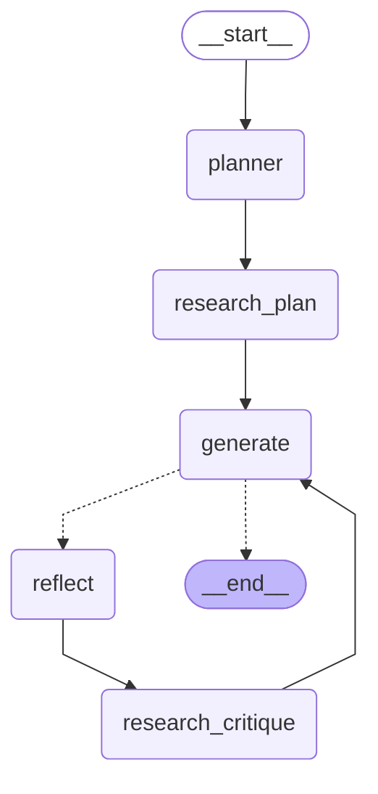

# Essay Writer Agent
Essay Writer implemented using LangGraph.

## Architecture

```mermaid
---
config:
  flowchart:
    curve: linear
---
graph TD;
        __start__([<p>__start__</p>]):::first
        planner(planner)
        research_plan(research_plan)
        generate(generate)
        reflect(reflect)
        research_critique(research_critique)
        __end__([<p>__end__</p>]):::last
        __start__ --> planner;
        generate -.-> __end__;
        generate -.-> reflect;
        planner --> research_plan;
        reflect --> research_critique;
        research_critique --> generate;
        research_plan --> generate;
        classDef default fill:#f2f0ff,line-height:1.2
        classDef first fill-opacity:0
        classDef last fill:#bfb6fc
```
