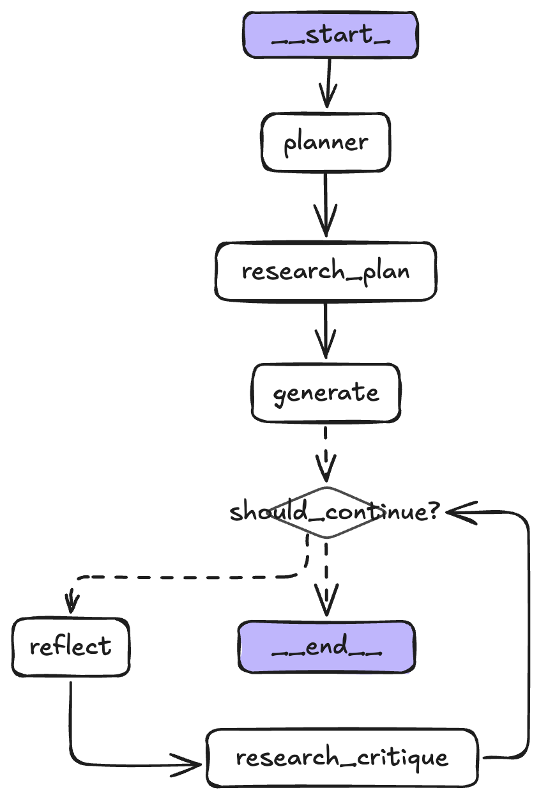
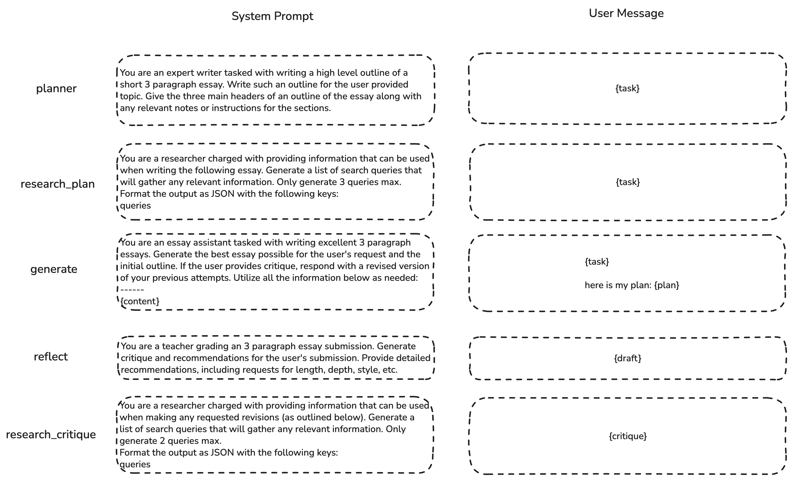
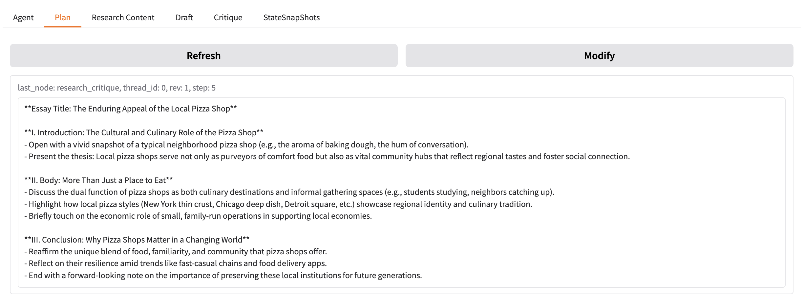
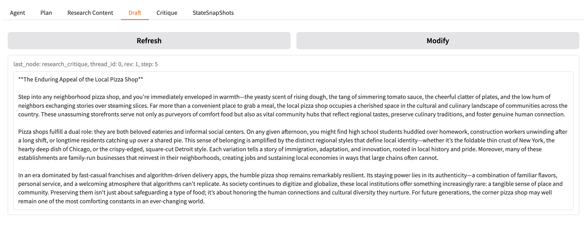
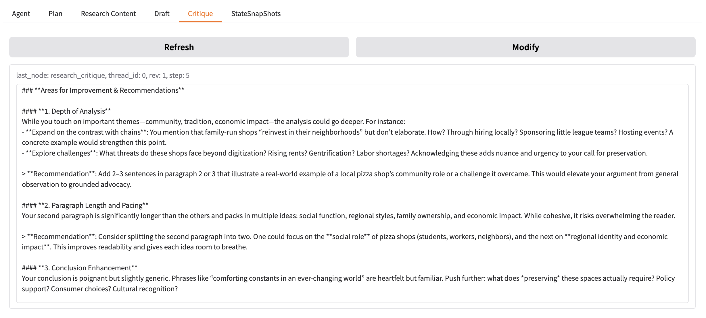
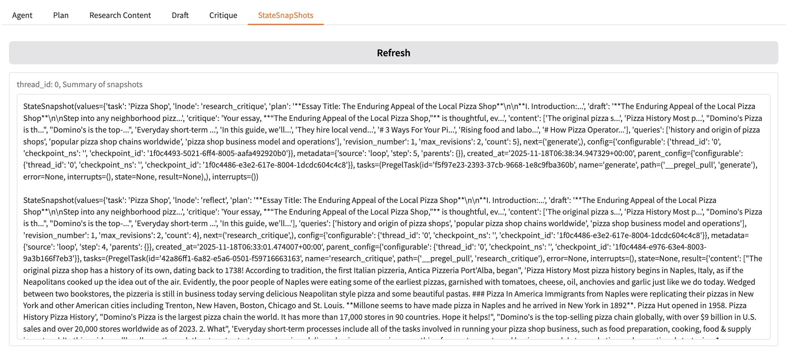

# Essay Writer Agent
Multi-Agent Essay Writer Assistant implemented using LangGraph, Qwen3-Max, Tavily Agentic Search Tool, Gradio,

## Features
- Generate high quality 3 paragraph essay for any topic
  - Use Planning pattern to generate outline and provide logical framework to draft the essay
  - Use Tavily Agentic search tool to do research and ensure accurate and up-to-date information
   - Use Reflection pattern for better quality essay
- Support user to modify Plan, Draft, Critique during the process
- Support lower level control of the Multi-Agent execution process
- Easy to use GUI with Gradio

## Backend Architecture
### Flow Chart

### Agent Prompts

## User Interface
### Agent Tab

### Plan Tab

### Research Content Tab

### Draft Tab

### Critique Tab

### StateSnapShots Tab

## Quick Start Guide
TO BE ADDED...

## LICENSE
This project is licensed under the MIT License - see the [LICENSE](./LICENSE)
